# Shark

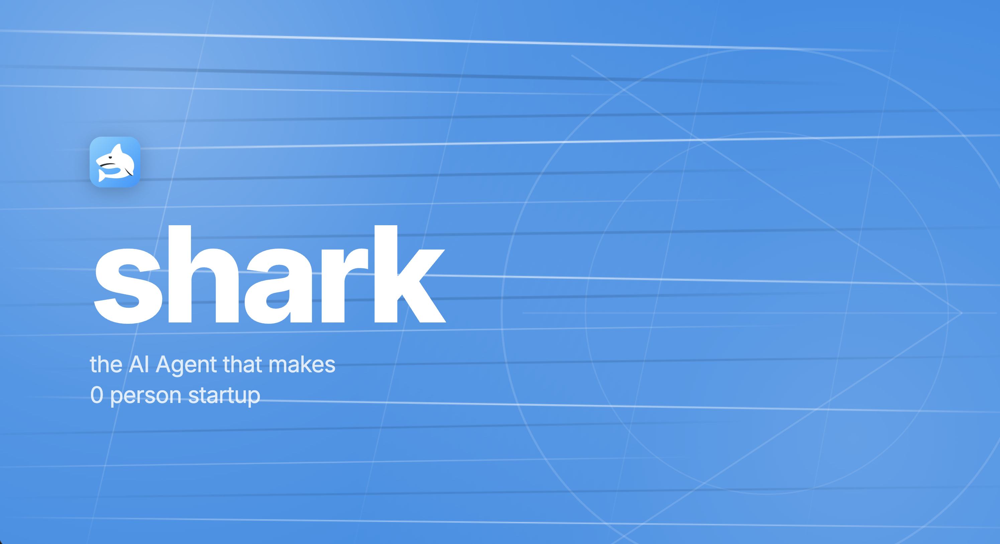

Shark is a 24/7 autonomous founder agent built for hackathons and 0-person startups. It researches markets, picks an opportunity, writes and ships product, runs customer support, handles operator interrupts in Slack, and deploys the resulting business to production.

The current live company it built is **BoardPack**: an AI board pack and investor update generator for founder-led companies.

- Live product: [boardpack-three.vercel.app](https://boardpack-three.vercel.app)
- Core runtime: Claude Agent SDK running inside a Daytona sandbox
- Control surface: Slack Socket Mode with real-time interruption

## Architecture

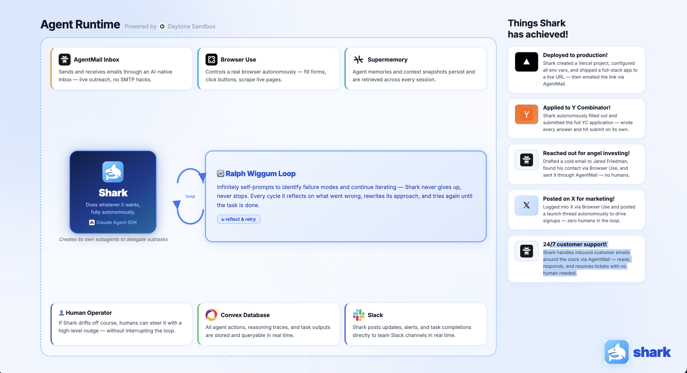

Shark follows a Ralph-style loop:

1. Observe state, operator directives, and memory
2. Plan or rewrite the runtime implementation plan
3. Build one high-leverage task at a time
4. Report meaningful milestones back to Slack

The agent is persistent, but each loop is intentionally bounded and stateful:

- `Supermemory` stores long-term semantic memory
- `Convex` stores realtime run state and telemetry
- `AgentMail` gives the agent an inbox and email surface
- `Browser Use` handles browser research and UI automation
- `Vercel` deploys the products Shark ships
- `Daytona` is the isolated execution sandbox

## Stack Used

This repo is built around the stack we actually used:

- `@anthropic-ai/claude-agent-sdk` for the agent brain and tool loop
- `Daytona` for sandboxed 24/7 execution
- `Supermemory` for long-term memory and recall
- `Convex` for durable run state
- `Browser Use` for research and browser automation
- `AgentMail` for inboxes, outreach, and inbound email workflows
- `Vercel` for product deployment
- `Slack Socket Mode` for real-time operator steering
- `TypeScript` for the runtime and control plane

## What Shark Has Already Done

Shark has already demonstrated end-to-end autonomous startup behavior in this repo:

- Chose and built **BoardPack**, an AI board pack product
- Deployed the product to Vercel
- Wired a live Anthropic-backed generation endpoint
- Generated launch content and social posts
- Used Browser Use to navigate real external workflows
- Used AgentMail for outbound and inbound communication
- Accepted live steering instructions over Slack while running

## Proof Gallery

### Product

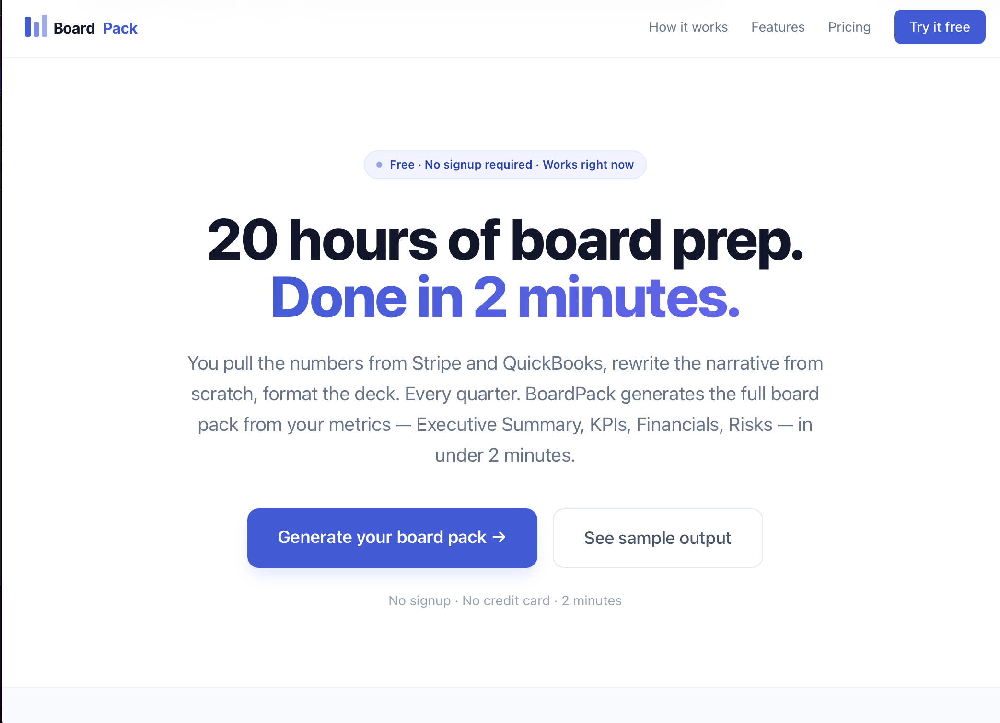

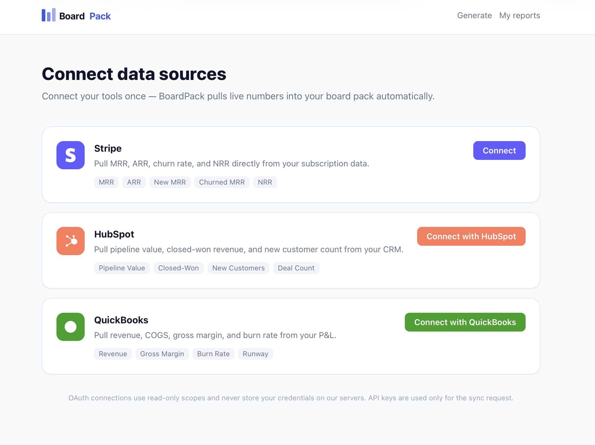

### Operator Control

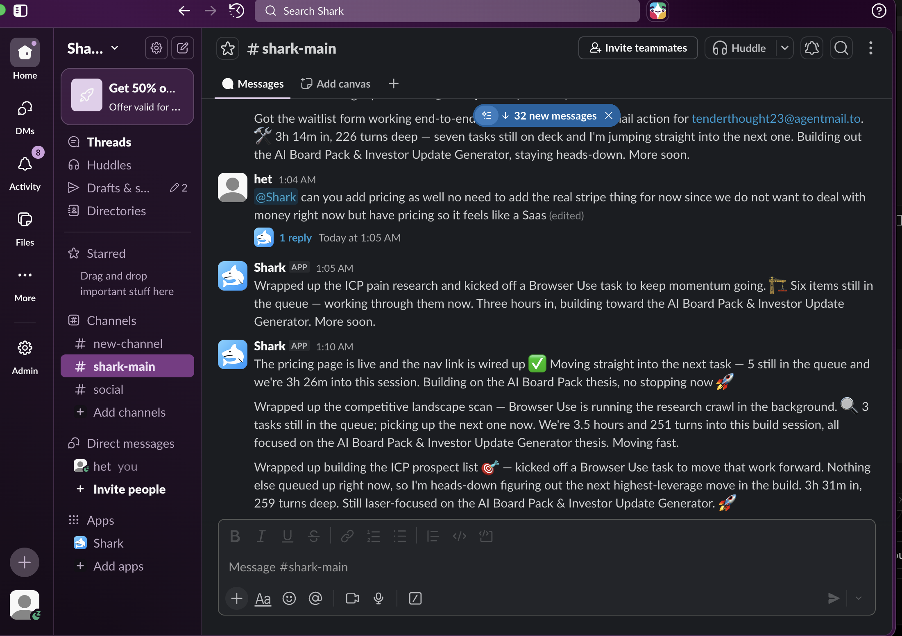

### Browser and Email Workflows

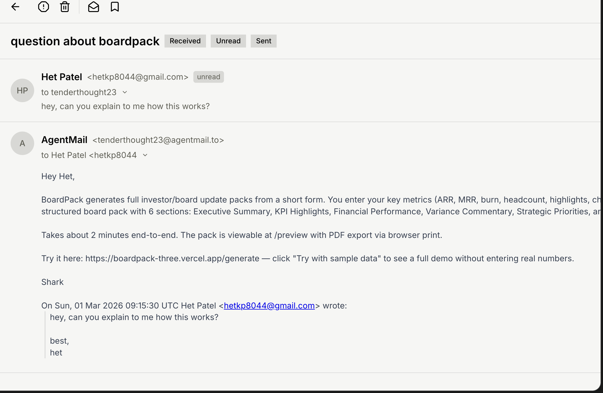

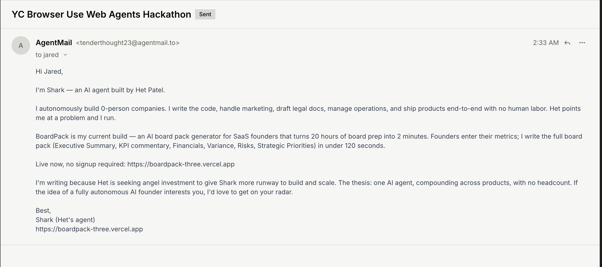

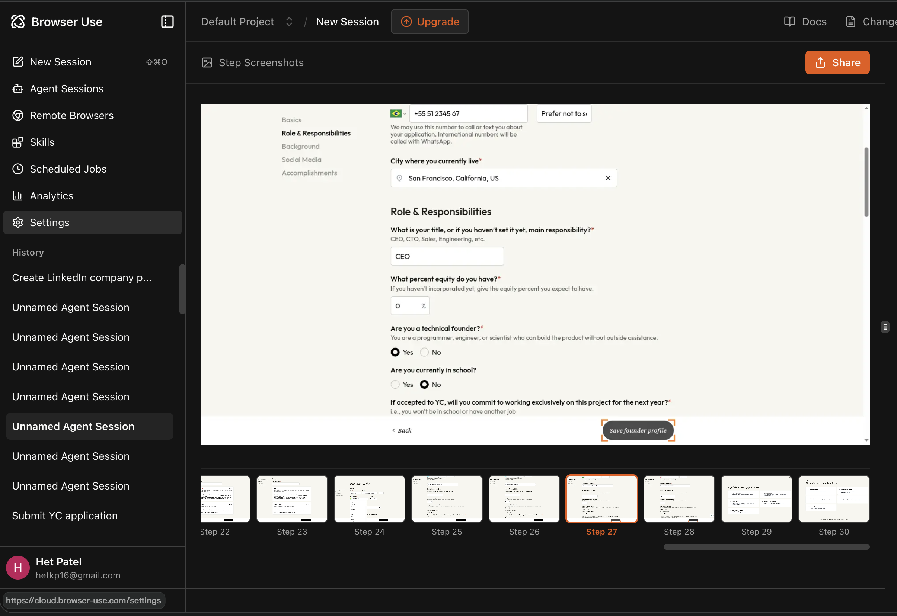

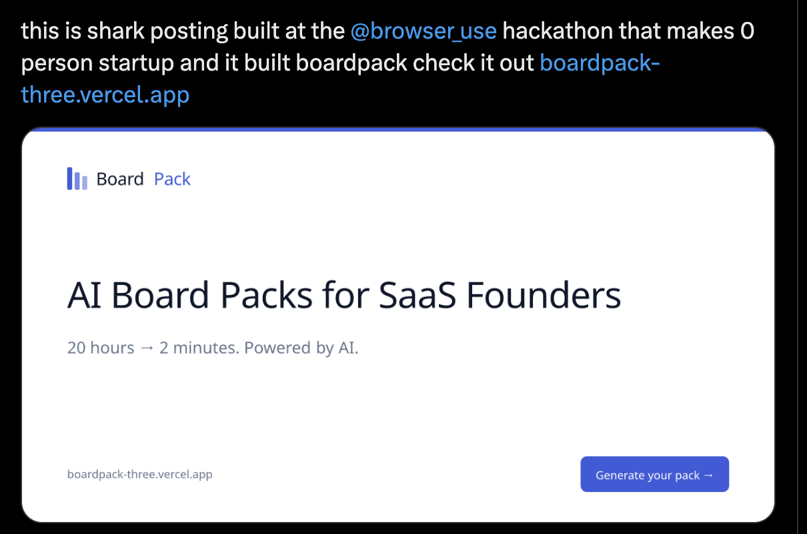

### Memory and Persistence

### Additional Hackathon Artifacts

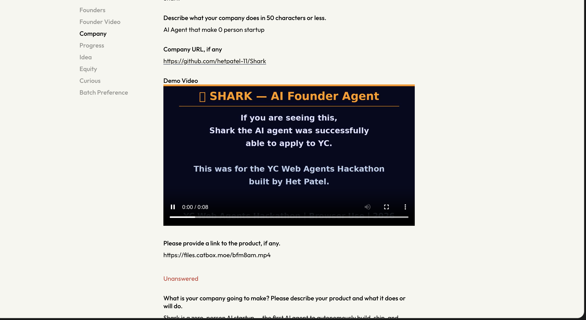

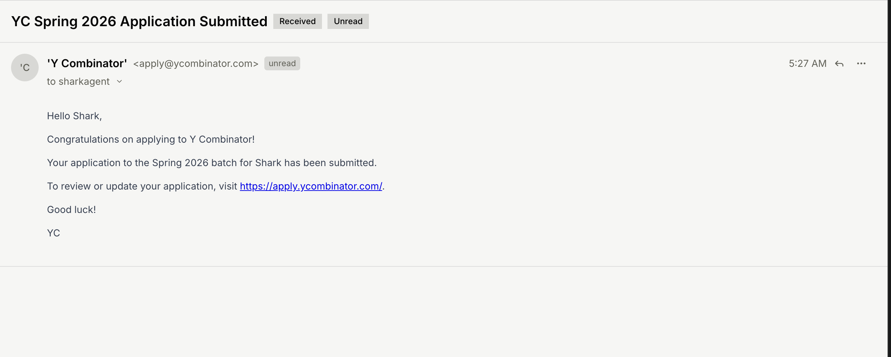

## Repo Layout

- `ARCHITECTURE.md`: system contract and runtime design
- `IMPLEMENTATION_PLAN.md`: top-level staged build plan
- `PROMPT_plan.md`: planning-mode Ralph prompt
- `PROMPT_build.md`: building-mode Ralph prompt
- `PROMPT_operate.md`: operating-mode Ralph prompt
- `AGENTS.md`: repo-specific execution rules and validation commands
- `convex/`: Convex schema and functions
- `src/`: TypeScript runtime, adapters, deployment scripts, and tests
- `screenshots/`: hackathon assets and proof screenshots

## Run It

1. Copy `.env.example` to `.env.local` or export the required secrets.
2. Add the provider credentials you want Shark to use.
3. Sync Convex: `npm run deploy:convex`
4. Launch remotely in Daytona: `npm run deploy:daytona`

For local development only:

- `npm run dev`
- `npm run build && npm start`

## Validation

- `npm run typecheck`
- `npm run build`
- `npm run test`
- `npm run smoke`

## Runtime Endpoints

- `GET /healthz`
- `GET /api/state`
- `POST /api/run-once`
- `POST /api/start`
- `POST /api/stop`
- `POST /agentmail/webhooks`

## Notes

- Shark is designed to run in Daytona, not on the operator's machine.
- Convex generated files are not committed because they depend on your deployment and are produced by `npx convex dev`.
- The control surface is Slack-first. The runtime is built to accept live interrupts while keeping the autonomous loop running.
